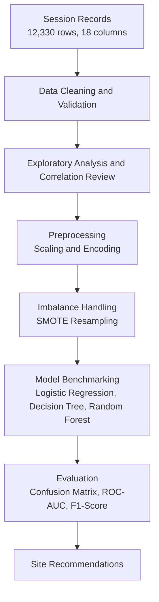

<div align="center">

```
  ___        _ _            ____  _                                
 / _ \ _ __ | (_)_ __   ___ / ___|| |__   ___  _ __  _ __   ___ _ __ 
| | | | '_ \| | | '_ \ / _ \\___ \| '_ \ / _ \| '_ \| '_ \ / _ \ '__|
| |_| | | | | | | | | |  __/ ___) | | | | (_) | |_) | |_) |  __/ |   
 \___/|_| |_|_|_|_| |_|\___||____/|_| |_|\___/| .__/| .__/ \___|_|   
                                              |_|   |_|              
```

# Online Shopper Purchasing Intention Analysis

Analysis and machine learning models for predicting e-commerce purchase completions using Google Analytics session metrics.

[](https://www.python.org/)
[](https://www.databricks.com/)
[](https://scikit-learn.org/)
[](https://archive.ics.uci.edu/dataset/468/online+shoppers+purchasing+intention+dataset)

</div>

---

## Overview

Most visitors to an online store leave without buying anything. Developed and executed in a Databricks environment, this project evaluates 12,330 e-commerce sessions to identify browsing behaviors associated with completed purchases, then tests classification models to predict whether a visitor will buy before leaving the site.

---

## Workflow

The workflow covers data cleaning through model evaluation:



---

## What the project covers

* Tracks session duration across administrative, informational, and product pages.
* Compares bounce rates, exit rates, and Google Analytics PageValues against completed transactions.
* Examines conversion differences across calendar months, weekend traffic, and visitor types (new vs. returning).
* Tests resampling techniques (such as SMOTE) to handle the class imbalance (84.5% non-purchases vs. 15.5% purchases).
* Measures feature importance to identify which browsing actions signal purchase intent.

---

## Dataset description

The analysis uses session-level records containing 10 numerical features and 8 categorical attributes:

| Category | Variables | Description |
| :--- | :--- | :--- |
| Page engagement | `Administrative`, `Informational`, `ProductRelated` | Number of distinct pages visited per category |
| Duration metrics | `Administrative_Duration`, `Informational_Duration`, `ProductRelated_Duration` | Total time spent in seconds within each category |
| Google Analytics | `BounceRates`, `ExitRates`, `PageValues` | Single-page bounces, page exits, and assigned page value |
| Context | `Month`, `SpecialDay`, `Weekend`, `VisitorType` | Proximity to holidays, month, day type, and customer return status |
| Target | `Revenue` | Whether the session ended in a purchase (`True` or `False`) |

> [!NOTE]
> About 84.5% of sessions ended without a purchase, and only 15.5% generated revenue. Because a model could reach 84.5% accuracy just by predicting `False` for every session, performance is measured using precision, recall, F1-score, and ROC-AUC.

---

## Findings

1. **PageValues is the strongest predictor**: Sessions with a `PageValues` score above zero convert far more frequently. High PageValues show that a user visited pages that previously contributed to a transaction.
2. **Bounce and exit rates**: Sessions with bounce rates above 0.05 rarely end in a purchase. High exit rates appear most often when users spend extended time on informational pages instead of checkout pages.
3. **New vs. returning visitors**: Returning visitors account for most total sales, but new visitors who buy tend to complete their checkout in fewer page visits.

> [!TIP]
> **Suggested application**: Use real-time session scoring to trigger targeted retention prompts. If a visitor spends significant time on product pages but starts showing exit patterns, an automated prompt or discount could help recover the sale.

---

## Model comparison

Models were evaluated using cross-validation on stratified test sets:

| Model | Precision (Purchasers) | Recall (Purchasers) | F1-Score (Purchasers) | ROC-AUC |
| :--- | :---: | :---: | :---: | :---: |
| Logistic Regression | 0.74 | 0.55 | 0.63 | 0.84 |
| Decision Tree | 0.68 | 0.72 | 0.70 | 0.80 |
| Random Forest (Balanced) | 0.78 | 0.79 | 0.78 | 0.92 |

> [!IMPORTANT]
> For sales optimization, missing an actual buyer costs more than showing an extra prompt to a non-buyer. Because of this trade-off, recall for the purchasing class was prioritized during tuning.

---

## Project structure

```text
.
├── .gitignore
├── requirements.txt
├── README.md
├── Online Retailer.csv                       # Primary dataset
└── Online Shopper Intentions Project.html     # Analysis and output report
```

---

## Quickstart

### Environment and Execution

The analysis and machine learning pipeline were built and executed in **Databricks**. 

* **Interactive Report**: Open [`Online Shopper Intentions Project.html`](Online%20Shopper%20Intentions%20Project.html) directly in any web browser to view the complete Databricks execution, charts, tables, and code without needing a live cloud cluster.
* **Import to Databricks**: You can import the exported code or HTML directly into your own Databricks workspace or run it locally in Python.

### Local Python Setup (Optional)

If running models locally:

1. Clone this repository:
   ```bash
   git clone https://github.com/GaryPhuah/Online-Shopper-Intent-Analysis.git
   cd Online-Shopper-Intent-Analysis
   ```

2. Create and activate a virtual environment:
   ```bash
   # Windows (PowerShell)
   python -m venv .venv
   .venv\Scripts\Activate.ps1

   # macOS / Linux
   python3 -m venv .venv
   source .venv/bin/activate
   ```

3. Install dependencies:
   ```bash
   pip install -r requirements.txt
   ```

---

## Acknowledgments

* **Project Authors**: Big Data Analytics Project Team (Sunway University / College)
* **Dataset Reference**: Sakar, C.O., Polat, S.O., Katircioglu, M. et al. *Real-time prediction of online shoppers' purchasing intention using multilayer perceptron and LSTM recurrent neural networks.* Neural Comput & Applic (2019).
