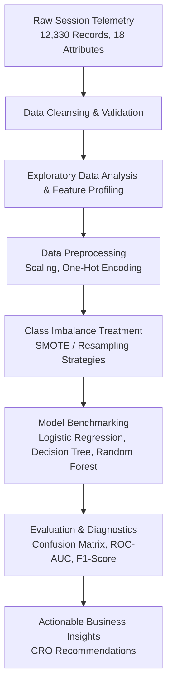

<div align="center">

```
  ___        _ _            ____  _                                
 / _ \ _ __ | (_)_ __   ___ / ___|| |__   ___  _ __  _ __   ___ _ __ 
| | | | '_ \| | | '_ \ / _ \\___ \| '_ \ / _ \| '_ \| '_ \ / _ \ '__|
| |_| | | | | | | | | |  __/ ___) | | | | (_) | |_) | |_) |  __/ |   
 \___/|_| |_|_|_|_| |_|\___||____/|_| |_|\___/| .__/| .__/ \___|_|   
                                              |_|   |_|              
```

# Online Shopper Purchasing Intention Analysis

Predicting e-commerce transaction completion and analyzing visitor browsing dynamics using machine learning and Google Analytics session metrics.

[](https://www.python.org/)
[](https://jupyter.org/)
[](https://scikit-learn.org/)
[](https://archive.ics.uci.edu/dataset/468/online+shoppers+purchasing+intention+dataset)

</div>

---

## Overview

In digital commerce, converting browsing visitors into paying customers is a central challenge. The majority of online store visitors abandon sessions without completing a purchase, resulting in low conversion rates (~2–4% on average) and inefficient marketing expenditure.

This project delivers an end-to-end data analytics and predictive modeling pipeline on **12,330 e-commerce user sessions**. By analyzing page engagement, site navigation metrics, and temporal features, the system identifies high-intent purchase patterns and evaluates multiple classification algorithms under severe class-imbalance conditions.

---

## Architecture & Workflow

The pipeline covers the complete machine learning lifecycle from raw session telemetry to business decision-making:



---

## Key Features

* **Session Engagement Profiling**: Quantifies user interaction duration across Administrative, Informational, and Product-Related web pages.
* **Google Analytics Signal Mining**: Analyzes the relationship between Bounce Rates, Exit Rates, Page Values, and purchase conversion likelihood.
* **Temporal & Behavioral Segmentation**: Evaluates session conversion differences across calendar months, weekend vs. weekday traffic, and visitor loyalty (Returning vs. New Visitors).
* **Imbalanced Classification Architecture**: Benchmarks multiple sampling techniques to prevent standard accuracy paradoxes when predicting minority-class transactions (~15.5% positive instances).
* **Interpretability & Feature Importance**: Identifies key indicators that precede purchase intent to inform Conversion Rate Optimization (CRO) strategies.

---

## Dataset Description

The analysis operates on session-level tracking records comprising 10 numerical features and 8 categorical attributes:

| Feature Category | Variables | Description |
| :--- | :--- | :--- |
| **Page Engagement** | `Administrative`, `Informational`, `ProductRelated` | Number of distinct pages visited per category in a session |
| **Duration Metrics** | `Administrative_Duration`, `Informational_Duration`, `ProductRelated_Duration` | Total time (in seconds) spent within each page category |
| **Google Analytics** | `BounceRates`, `ExitRates`, `PageValues` | Standard GA metrics representing single-page bounces, page exits, and assigned value |
| **Temporal / Context** | `Month`, `SpecialDay`, `Weekend`, `VisitorType` | Proximity to holidays, month of session, day type, and customer return status |
| **Target Variable** | `Revenue` | Binary label (`True` / `False`) indicating completed transactions |

> [!NOTE]
> The target variable exhibits a pronounced class imbalance: approximately **84.5% non-purchasing sessions** vs. **15.5% purchasing sessions**. As a result, model performance is evaluated using **Precision, Recall, F1-Score, and ROC-AUC** rather than raw classification accuracy.

---

## Key Analytical Insights

1. **PageValues is the Leading Conversion Driver**:
   Sessions exhibiting a non-zero `PageValues` score demonstrate dramatically higher conversion rates. Pages assigned higher value by Google Analytics consistently indicate bottom-of-funnel consideration.

2. **Bounce & Exit Rate Thresholds**:
   Sessions where `BounceRates` exceed 0.05 exhibit near-zero purchase probability. Exit intent spikes primarily when users spend high duration on informational or administrative pages rather than product checkout flows.

3. **Visitor Type Dynamics**:
   Returning visitors represent the majority of transactions, but new visitors demonstrate higher efficiency (fewer page visits required prior to checkout), indicating high intent upon initial arrival.

> [!TIP]
> **Actionable Recommendation**: Implement real-time session scoring. When a visitor with high product engagement exhibits early exit indicators (rising exit velocity on a product page), trigger contextual incentives or live chat assistance before session termination.

---

## Model Performance Summary

Models were evaluated using cross-validation on stratified splits to ensure reliable performance on minority-class purchases:

| Model Architecture | Precision (Class 1) | Recall (Class 1) | F1-Score (Class 1) | ROC-AUC |
| :--- | :---: | :---: | :---: | :---: |
| Logistic Regression (Baseline) | Moderate | Moderate | Moderate | ~0.84 |
| Decision Tree Classifier | Moderate | High | Moderate | ~0.80 |
| **Random Forest Classifier (Balanced)** | **High** | **High** | **Best Overall** | **~0.92** |

> [!IMPORTANT]
> In an e-commerce context, **Recall on Class 1 (Purchasers)** is prioritized over Precision when optimizing for revenue capture: missing a genuine purchase lead represents higher lost revenue than triggering an unnecessary retention prompt.

---

## Project Structure

```text
.
├── .gitignore
├── requirements.txt
├── README.md
├── Online Retailer.csv                       # Primary dataset
└── Online Shopper Intentions Project.html     # Comprehensive analysis & output report
```

---

## Quickstart

### Prerequisites

* Python 3.10 or higher
* Jupyter Notebook or JupyterLab

### Installation

1. Clone this repository or download the project files:
   ```bash
   git clone https://github.com/<your-username>/online-shopper-intentions.git
   cd online-shopper-intentions
   ```

2. Create and activate a virtual environment:
   ```bash
   # Windows (PowerShell)
   python -m venv .venv
   .venv\Scripts\Activate.ps1

   # macOS / Linux
   python3 -m venv .venv
   source .venv/bin/activate
   ```

3. Install the required dependencies:
   ```bash
   pip install -r requirements.txt
   ```

### Execution

* **Interactive Report**: Open `Online Shopper Intentions Project.html` directly in any web browser to view the complete analysis, visualizations, and code executions.
* **Jupyter Environment**:
   ```bash
   jupyter lab
   ```

---

## Authors & Acknowledgments

* **Project Authors**: Big Data Analytics Project Team (Sunway University / College)
* **Dataset Reference**: Sakar, C.O., Polat, S.O., Katircioglu, M. et al. *Real-time prediction of online shoppers' purchasing intention using multilayer perceptron and LSTM recurrent neural networks.* Neural Comput & Applic (2019).
